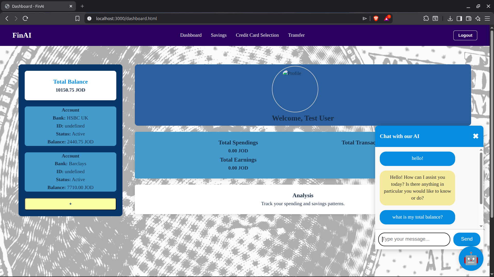
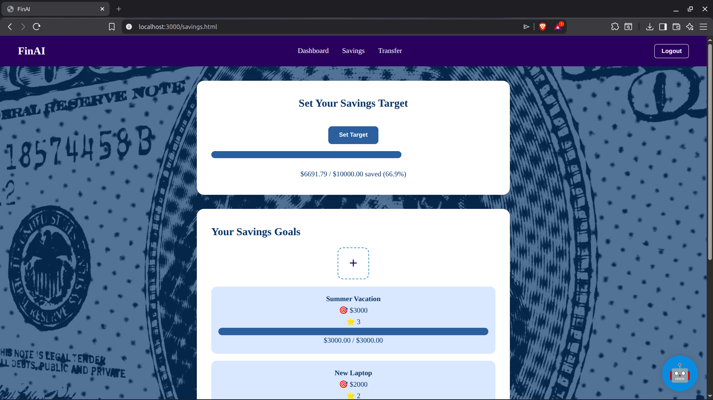

# FinAI Personal

A personal finance management web app with an AI-powered banking assistant, savings goal tracking, and bank account integration.

---

## Table of Contents

- [Features](#features)
- [Screenshots](#screenshots)
- [Tech Stack](#tech-stack)
- [Project Structure](#project-structure)
- [Getting Started](#getting-started)
- [AI Agent](#ai-agent)
- [Notes](#notes)

---

## Features

- **AI Banking Assistant** — Chat with a local LLM (via Ollama) that can query your accounts, check balances, and transfer money between accounts
- **Bank Account Integration** — Connect real bank accounts using the GoCardless API
- **Savings Goals** — Create and track savings goals with priorities and target amounts
- **Dashboard** — Overview of balances and recent transactions
- **User Auth** — Signup, login, and profile management with photo upload

---

## Screenshots

**Dashboard & AI Chatbot**


**Savings Goals**


---

## Tech Stack

| Layer | Tech |
|---|---|
| Frontend | HTML, CSS, Vanilla JS |
| Backend | Node.js, Express |
| Database | PostgreSQL |
| AI Agent | Python, Ollama (`qwen2.5-coder:3b`), FastAPI |
| MCP Server | Python, FastMCP |
| Bank Integration | GoCardless |

---

## Project Structure

```
FinAI Personal/
├── database/
│   └── finai.sql            # PostgreSQL schema
├── mcp/
│   ├── agent-local.py       # FastAPI AI agent (runs separately)
│   └── mcp_server.py        # MCP tool server (banking tools)
├── public/                  # Static frontend
│   ├── *.html               # Pages (dashboard, login, signup, savings)
│   ├── css/                 # Per-page stylesheets
│   ├── js/                  # Per-page scripts
│   └── assets/              # Images, videos
└── server/
    ├── server.js            # Express entry point
    ├── db.js                # PostgreSQL connection
    └── api/
        ├── auth/            # Auth & bank account endpoints
        ├── savings/         # Savings goals endpoints
        └── transactions/    # Transfer endpoints
```

---

## Getting Started

### Prerequisites

- Node.js (v18+)
- Python 3.10+
- PostgreSQL
- [Ollama](https://ollama.com) with `qwen2.5-coder:3b` pulled

### 1. Database Setup

Create a PostgreSQL database named `finai` and run the schema:

```bash
psql -U postgres -c "CREATE DATABASE finai;"
psql -U postgres -d finai -f database/finai.sql
```

The MCP server connects with these defaults:
- **Host:** `localhost`
- **Port:** `5432`
- **User:** `postgres`
- **Password:** `1`

Update credentials in `mcp/mcp_server.py` if needed.

### 2. Node.js Server

```bash
npm install
node server/server.js
```

### 3. AI Agent (runs separately)

Install Python dependencies:

```bash
pip install fastapi uvicorn ollama mcp psycopg2-binary
```

Pull the model:

```bash
ollama pull qwen2.5-coder:3b
```

Start the agent:

```bash
python mcp/agent-local.py
```

The agent runs at `http://localhost:8000` and exposes a `/chat` endpoint.

---

## AI Agent

The agent accepts POST requests to `/chat`:

```json
{
  "message": "What's my total balance?",
  "user_id": 1
}
```

It uses the MCP server tools to fetch real data from the database and responds in plain English. Available tools:

- `get_user_accounts` — List all active bank accounts
- `get_total_balance` — Sum of all account balances
- `get_saving_goals` — List savings goals with progress
- `internal_transfer` — Transfer between two of the user's accounts

---

## Notes

- The MCP server (`mcp_server.py`) is spawned automatically by the agent as a subprocess — you don't need to run it manually
- Logs are written to `mcp_server.log` in the directory where you run the agent
- Bank connections use the GoCardless API; you'll need a GoCardless account and API credentials configured in the server